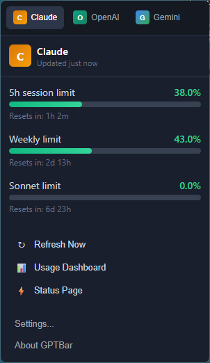

# GPTBar

A cross-platform system tray application to monitor your AI API usage. Inspired by [CodexBar](https://github.com/steipete/CodexBar).



## Features

- **Multi-Provider Monitoring** - Track usage for Claude, OpenAI, Gemini, and Codex
- **Cross-Platform** - Works on Windows, macOS, and Linux
- **System Tray Integration** - Visual usage indicators in the taskbar/menu bar
- **Session & Weekly Limits** - Monitor 5-hour session and weekly usage caps
- **Notifications** - Get alerts when approaching usage limits (80%, 95%)
- **Secure Storage** - Credentials stored using OS keyring (Windows Credential Manager, macOS Keychain, Linux Secret Service)
- **Background Refresh** - Automatic updates every 5 minutes
- **Lightweight** - Built with Tauri for minimal resource footprint

## Supported Providers

| Provider | Status | Authentication |
|----------|--------|----------------|
| Claude (Anthropic) | Full support | Browser session token |
| OpenAI | Full support | API Key |
| Gemini (Google) | Full support | API Key |
| Codex | Basic support | API Key |

## Installation

### Prerequisites

1. **Rust** - Install from [rustup.rs](https://rustup.rs)
2. **Node.js** - Version 18 or higher
3. **Platform-specific**:
   - **Windows**: Visual Studio Build Tools
   - **macOS**: Xcode Command Line Tools (`xcode-select --install`)
   - **Linux**: `build-essential`, `libwebkit2gtk-4.1-dev`, `libssl-dev`, `libayatana-appindicator3-dev`

### Build from Source

```bash
# Clone the repository
git clone https://github.com/episuarez/gptBar.git
cd gptBar

# Install dependencies
npm install

# Development mode
npm run tauri dev

# Build for production
npm run tauri build
```

The installer will be in `src-tauri/target/release/bundle/`.

## Usage

1. **Launch** - GPTBar starts minimized in your system tray
2. **Click tray icon** - Opens the usage dashboard
3. **Configure providers** - Click settings to enable/disable providers
4. **Login** - Click "Login" for each provider to add credentials
5. **View Usage** - Usage bars show current consumption
6. **Refresh** - Click the refresh button or wait for auto-refresh

### Keyboard Shortcuts

- `Escape` - Close the window
- Click outside - Auto-hide

## Architecture

```
gptBar/
├── src-tauri/                # Rust backend
│   ├── src/
│   │   ├── providers/        # AI provider integrations
│   │   │   ├── base.rs       # Provider trait & types
│   │   │   ├── claude.rs     # Claude implementation
│   │   │   ├── openai.rs     # OpenAI implementation
│   │   │   ├── gemini.rs     # Gemini implementation
│   │   │   └── codex.rs      # Codex implementation
│   │   ├── auth/             # Authentication
│   │   │   ├── secure_store.rs
│   │   │   └── cookie_extractor.rs
│   │   ├── agents/           # Background tasks
│   │   │   ├── refresh_agent.rs
│   │   │   └── notification_agent.rs
│   │   └── security/         # Security utilities
│   │       ├── sanitizer.rs
│   │       └── secure_string.rs
│   └── Cargo.toml
├── src/                      # Svelte frontend
│   ├── lib/
│   │   ├── components/
│   │   │   ├── ProviderCard.svelte
│   │   │   ├── ProviderTabs.svelte
│   │   │   └── UsageBar.svelte
│   │   └── types.ts
│   └── routes/
│       └── +page.svelte
└── package.json
```

## Tech Stack

- **Backend**: Rust + Tauri 2.0
- **Frontend**: Svelte 5 + TypeScript
- **Secure Storage**: OS Keyring (keyring-rs)
  - Windows: Credential Manager
  - macOS: Keychain
  - Linux: Secret Service (GNOME Keyring, KWallet)
- **HTTP**: reqwest with rustls

## Security

- API keys stored in OS secure keyring
- No plaintext secrets in logs (sanitization)
- SecureString with zeroization for sensitive data
- HTTPS only with certificate validation

## Development

### Running Tests

```bash
# Rust tests
cd src-tauri
cargo test

# With coverage
cargo tarpaulin --out Html
```

### Commands

```bash
npm run dev           # Start Vite dev server
npm run tauri dev     # Start full Tauri dev environment
npm run build         # Build frontend
npm run tauri build   # Build complete application
npm run check         # Run Svelte type checker
npm run lint          # Run linter
```

### Project Principles

- **TDD**: Tests written before implementation
- **SOLID**: Single responsibility, Open/closed, Liskov substitution, Interface segregation, Dependency inversion
- **Security First**: All sensitive data handled securely

## Configuration

Settings are stored in your OS config directory:
- **Windows**: `%APPDATA%/gptbar/config.json`
- **macOS**: `~/Library/Application Support/gptbar/config.json`
- **Linux**: `~/.config/gptbar/config.json`

## Authentication Methods

1. **OAuth** (Preferred) - Via api.anthropic.com
2. **Browser Cookies** - Extracted from Chrome/Edge/Firefox
3. **API Keys** - Direct API key input

## Recommended IDE Setup

[VS Code](https://code.visualstudio.com/) + [Svelte](https://marketplace.visualstudio.com/items?itemName=svelte.svelte-vscode) + [Tauri](https://marketplace.visualstudio.com/items?itemName=tauri-apps.tauri-vscode) + [rust-analyzer](https://marketplace.visualstudio.com/items?itemName=rust-lang.rust-analyzer)

## Contributing

Contributions are welcome! Please feel free to submit a Pull Request.

1. Fork the repository
2. Create your feature branch (`git checkout -b feature/amazing-feature`)
3. Commit your changes (`git commit -m 'Add some amazing feature'`)
4. Push to the branch (`git push origin feature/amazing-feature`)
5. Open a Pull Request

## Releases

Releases are automatically generated when a tag is pushed:

```bash
git tag v0.1.0
git push origin v0.1.0
```

This triggers GitHub Actions to build binaries for Windows, macOS (Intel + Apple Silicon), and Linux, then uploads them to the release.

Tags with `-` (e.g., `v0.1.0-beta`) are marked as pre-release.

## License

GPL-3.0 - See [LICENSE](LICENSE) for details.

## Credits

- Inspired by [CodexBar](https://github.com/steipete/CodexBar) by steipete
- Built with [Tauri](https://tauri.app) and [Svelte](https://svelte.dev)
