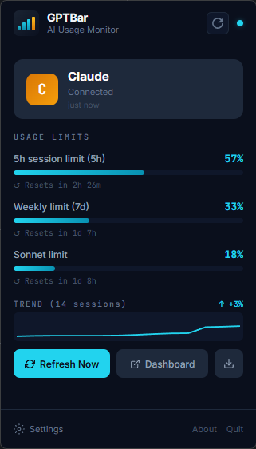
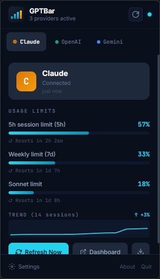
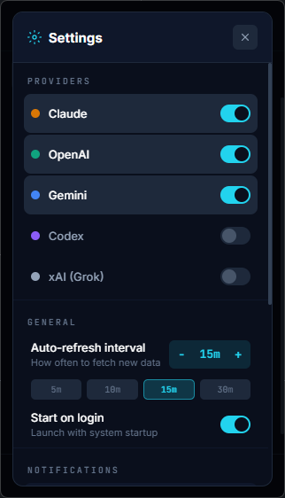

<p align="center">
  
</p>

<h1 align="center">GPTBar</h1>

<p align="center">
  System tray app to monitor AI provider usage in real time.<br>
  Built with <a href="https://tauri.app">Tauri 2</a> + <a href="https://svelte.dev">Svelte 5</a>. Inspired by <a href="https://github.com/steipete/CodexBar">CodexBar</a>.
</p>

<p align="center">
  
  &nbsp;&nbsp;
  
  &nbsp;&nbsp;
  
</p>

## Providers

| Provider | Auth | What it tracks |
|----------|------|----------------|
| **Claude** (Anthropic) | OAuth | Session, weekly & model limits |
| **OpenAI** | API Key | Billing usage & limits |
| **Gemini** (Google) | API Key | Quota usage |
| **Codex** | API Key | Token usage |
| **xAI** (Grok) | API Key | Token & balance usage |

## Features

- **Tray icon** changes color with usage level — cyan (ok), amber (warning), red (critical)
- **Multi-provider tabs** — switch between providers in one window
- **Desktop notifications** with configurable thresholds and per-window cooldowns
- **Usage history** with sparkline charts, exportable to JSON/CSV
- **Secure storage** — credentials in OS keyring (Windows Credential Manager / macOS Keychain / Linux Secret Service)
- **Auto-refresh** every 10 minutes (configurable), with client-side rate limiting

## Quick Start

**Prerequisites:** [Rust](https://rustup.rs), Node.js 18+, and platform build tools (VS Build Tools on Windows, Xcode CLI on macOS, `build-essential` + `libwebkit2gtk-4.1-dev` + `libssl-dev` + `libayatana-appindicator3-dev` on Linux).

```bash
git clone https://github.com/episuarez/gptBar.git
cd gptBar
npm install
npm run tauri dev      # development
npm run tauri build    # production → src-tauri/target/release/bundle/
```

## Configuration

Settings are stored in your OS config directory as `config.json`:

| OS | Path |
|----|------|
| Windows | `%APPDATA%/gptbar/` |
| macOS | `~/Library/Application Support/gptbar/` |
| Linux | `~/.config/gptbar/` |

## Releases

Push a tag to trigger CI builds for Windows, macOS (Intel + Apple Silicon), and Linux:

```bash
git tag v0.2.0
git push origin v0.2.0
```

Tags with `-` (e.g. `v0.2.0-beta`) are marked as pre-release.

## License

[GPL-3.0](LICENSE)

## Credits

Inspired by [CodexBar](https://github.com/steipete/CodexBar) by steipete.
